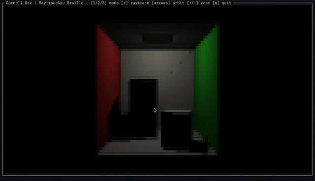
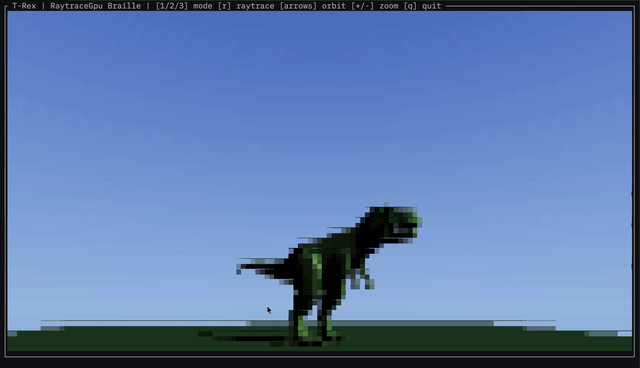
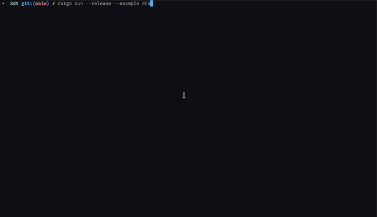

# ratatui-3d

A 3D software renderer for terminal UIs, built on [ratatui](https://ratatui.rs).

Render 3D scenes directly in your terminal — no GPU required. Load models, add lights, and display everything as a ratatui widget.

<table align="center">
  <tr>
    <td align="center"><br /><sub>Cornell Box</sub></td>
    <td align="center"><br /><sub>T-Rex (glTF)</sub></td>
    <td align="center"><br /><sub>DNA Helix</sub></td>
  </tr>
</table>

## Features

- **Software rasterizer** with depth buffering and backface culling
- **Phong shading** with ambient, directional, and point lights
- **Three render modes** — HalfBlock (color), Braille (high-res mono), ASCII
- **Model loading** — OBJ and glTF/glB formats (optional feature flags)
- **Built-in primitives** — cube, sphere, plane
- **Camera controls** — orbit, zoom, perspective projection
- **Ratatui widget** — drops into any ratatui layout as `StatefulWidget` or `Widget`
- **GIF export** — render to image files with transparent backgrounds using the built-in alpha channel

## Quick start

```toml
[dependencies]
ratatui-3d = "0.1"
```

```rust
use ratatui_3d::prelude::*;

// Build a scene
let mut scene = Scene::new();
scene.add_object(
    SceneObject::new(primitives::cube())
        .with_material(Material::default().with_color(Rgb(100, 150, 255))),
);
scene.add_light(Light::ambient(Rgb(255, 255, 255), 0.2));
scene.add_light(Light::directional(Vec3::new(-1.0, -1.0, -1.0), Rgb(255, 255, 255)));

// Render as a ratatui widget
let mut state = Viewport3DState::default();
f.render_stateful_widget(Viewport3D::new(&scene), area, &mut state);
```

## Render modes

Switch between modes at runtime (press `1`, `2`, `3` in the examples):

| Mode | Resolution | Description |
|------|-----------|-------------|
| `HalfBlock` | 1x2 pixels/cell | Full color using `▀` characters |
| `Braille` | 2x4 pixels/cell | High resolution monochrome dots |
| `Ascii` | 1x1 pixel/cell | Colored ASCII shading ramp |

## Loading models

Both loaders are enabled by default. Disable with `default-features = false` and pick what you need:

```toml
# Just OBJ
ratatui-3d = { version = "0.1", default-features = false, features = ["obj"] }

# Just glTF
ratatui-3d = { version = "0.1", default-features = false, features = ["gltf"] }

# No loaders (primitives only)
ratatui-3d = { version = "0.1", default-features = false }
```

```rust
// OBJ
let meshes = ratatui_3d::loader::obj::load_obj("model.obj")?;

// glTF / glB
let meshes = ratatui_3d::loader::gltf::load_gltf("model.glb")?;
```

## Examples

Run the examples with:

```sh
cargo run --example cube                      # Interactive scene with cube, sphere, and plane
cargo run --example trex --features gltf,gpu  # Spinning T-Rex loaded from a glTF model
cargo run --example trex_gif --features gltf,gpu  # Export T-Rex as transparent GIF
```

Controls: arrow keys to orbit, `+`/`-` to zoom, `1`/`2`/`3` to switch render mode, `q` to quit.

## GIF export with transparency

The framebuffer includes a per-pixel alpha channel — pixels where geometry is rendered get `alpha = 255`, and background pixels stay at `0`. This works across all three pipeline backends (rasterize, raytrace CPU, raytrace GPU), so you can render scenes headlessly and export to image formats with transparent backgrounds.

```rust
use ratatui_3d::pipeline::Framebuffer;

let mut fb = Framebuffer::new(400, 300);
gpu.render(&scene, &camera, &mut fb);

// Each pixel has color (fb.color) and alpha (fb.alpha)
for i in 0..(fb.width * fb.height) as usize {
    let c = fb.color[i];
    let a = fb.alpha[i]; // 0 = transparent, 255 = opaque
    // write to your image format of choice
}
```

See [`examples/trex_gif.rs`](crates/ratatui-3d/examples/trex_gif.rs) for a full example that renders an animated GIF with auto-cropping and optional pixel scaling for a chunky retro look.

## API overview

| Type | Purpose |
|------|---------|
| `Scene` | Container for objects and lights |
| `SceneObject` | Mesh + material + transform |
| `Mesh` / `Vertex` | Indexed triangle mesh |
| `Material` | Phong properties (color, ambient, diffuse, specular, shininess) |
| `Light` | Ambient, directional, or point light |
| `Camera` | Position/target with orbit and zoom |
| `Transform` | Position, rotation (quaternion), scale |
| `Framebuffer` | Pixel buffer with color, depth, and alpha channels |
| `Viewport3D` | Stateful ratatui widget |
| `Viewport3DStatic` | One-shot ratatui widget (no persistent state) |
| `RenderMode` | HalfBlock, Braille, or Ascii |
| `primitives` | `cube()`, `sphere(stacks, slices)`, `plane()` |

## License

MIT
